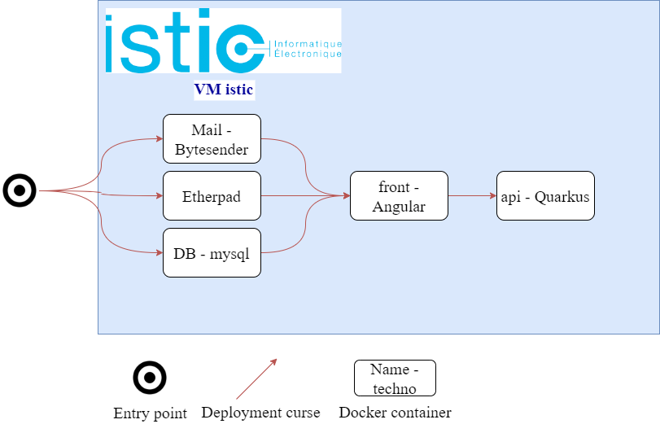

# Step to reproduce
## Build front
Go to front directory:

* Requires Angular CLI

```shell
    $ npm install

    $ npm fund

    $ ng build --prod

```
## Build backend
Go to api directory :

 * Requires Java openjdk-11

```shell
    $ ./mvnw clean package -Dquarkus.package.type=uber-jar
```

## Deploy
 * Requires docker-compose

```shell
    $ docker-compose up --detach
```

## Container status



### Current steps done for the lab
Task 4 : API is deployed with all services and nginx. A diagram of the structure has been linked.

WIP : 
 * CI mechanism
 * Monitoring with prometheus
 * Kubernetes
 * Keycloak